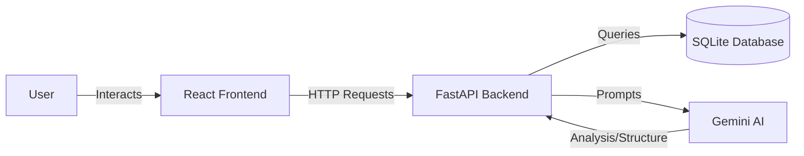

# Aerchain RFP System

The Aerchain RFP System is an intelligent Request for Proposal (RFP) management platform designed to streamline the procurement process. It uses advanced AI to generate RFP structures from natural language, manage vendor communications, and automatically analyze and compare vendor proposals to recommend the best fit.

## Prerequisites

Before starting, ensure you have the following installed:
- **Python 3.10+** (for the backend)
- **Node.js 18+** (for the frontend)
- A **Google Gemini API Key** (get one from [Google AI Studio](https://aistudio.google.com/))

## Installation

### 1. Clone the Repository
```bash
git clone <repository-url>
cd AerchainProject
```

### 2. Backend Setup
Navigate to the backend directory and set up the Python environment.

```bash
cd backend
python -m venv venv

# On Windows:
venv\Scripts\activate
# On macOS/Linux:
source venv/bin/activate

pip install -r requirements.txt
```

**Configuration**:
1. Create a `.env` file in the `backend` directory.
2. Add your Google API Key:
   ```
   GOOGLE_API_KEY=your_actual_api_key_here
   ```

### 3. Frontend Setup
Navigate to the frontend directory and install dependencies.

```bash
cd ../frontend
npm install
```

## Running the Application

**Terminal 1: Backend**
```bash
cd backend
# Activate venv if not already active
python -m uvicorn main:app --reload
```
The API will be available at `http://localhost:8000`.

**Terminal 2: Frontend**
```bash
cd frontend
npm run dev
```
The UI will be available at `http://localhost:5173`.

## Tech Stack & Justification

### Frontend
- **Framework**: **React** with **Vite**
    - *Justification*: Vite provides an extremely fast development server and build tool. React is used for its component-based architecture, making the UI modular and maintainable.
- **Styling**: **TailwindCSS** & **shadcn/ui**
    - *Justification*: Tailwind allows for rapid styling directly in markup. shadcn/ui provides high-quality, accessible, and customizable components (like Tabs, Cards, Dialogs) out of the box, ensuring a premium look and feel.
- **State/Data**: React Hooks & Axios
    - *Justification*: Simple and effective state management for the current scale of the application.

### Backend
- **Framework**: **FastAPI**
    - *Justification*: A modern, fast (high-performance) web framework for building APIs with Python 3.6+ based on standard Python type hints. It offers automatic interactive API documentation (Swagger UI).
- **Database**: **SQLModel** (SQLite)
    - *Justification*: SQLModel combines SQLAlchemy and Pydantic, offering the power of a relational database with the ease of use of Pydantic models. SQLite is suitable for this standalone demonstration/MVP.
- **Language**: Python 3.10+

### AI Integration
- **Provider**: **Google Gemini (via `google-genai` SDK)**
- **Model**: `gemini-2.5-flash-lite`
    - *Justification*: A lightweight yet capable multimodal model that excels at text analysis, structured data extraction, and comparative reasoning, making it perfect for processing complex RFP documents and proposals.

## Architecture

The application follows a modern client-server architecture:



1.  **Client**: The frontend handles user interactions (creating RFPs, viewing dashboards, comparing proposals).
2.  **Server**: The backend exposes REST endpoints to manage resources (RFPs, Vendors, Proposals).
3.  **AI Service**: A dedicated service layer interacts with the Gemini API to perform intelligence tasks.
4.  **Persistence**: Data is stored in a local SQLite database file (`database.db`).

## Application Flow

1.  **RFP Generation**:
    - User enters a rough description (e.g., "Need 50 laptops for engineering").
    - AI analyzes this text and extracts structured data (Title, Budget, Requirements).
    - User reviews, edits, and saves the RFP.

2.  **Vendor Communication**:
    - User selects vendors to invite.
    - System "sends" emails (simulated in logs/files) to vendors.

3.  **Proposal Submission**:
    - Vendors (or the user acting as a vendor) submit proposals.
    - **AI Analysis**: Upon submission, the AI immediately analyzes the proposal text against the RFP requirements, scoring it (0-100) and extracting pros/cons.

4.  **Comparison & Decision**:
    - User selects an RFP to compare proposals.
    - **AI Comparison**: The AI reviews all proposals side-by-side and produces a comparison matrix and a final recommendation.

## API Endpoints

### RFPs (`/rfps`)
- `POST /rfps/generate`: Analyzes natural language input to suggest an RFP structure (AI-powered).
- `POST /rfps/`: Creates a new RFP in the database.
- `GET /rfps/`: Retrieves a list of all RFPs.
- `GET /rfps/{id}`: Retrieves details of a specific RFP.
- `POST /rfps/{id}/send`: Sends the RFP to selected vendors (simulated email).

### Vendors (`/vendors`)
- `POST /vendors/`: Registers a new vendor.
- `GET /vendors/`: Lists all registered vendors.
- `GET /vendors/{id}`: Retrieves specific vendor details.

### Proposals (`/proposals`)
- `POST /proposals/`: Submits a vendor proposal. **Triggers AI Analysis**.
- `GET /proposals/rfp/{rfp_id}`: Lists all proposals for a specific RFP.
- `POST /proposals/compare/{rfp_id}`: Performs a comparative analysis of all proposals for an RFP (AI-powered).

## Verification & Testing

### Testing Strategy
We utilized a combination of manual verification and end-to-end flow testing:

1.  **Component Testing**: Checked individual API endpoints using the auto-generated Swagger UI (`http://localhost:8000/docs`). This ensured that request/response schemas were correct.
2.  **Integration Testing**: Verified the interaction between the Backend and the AI Service by inspecting logs and checking the quality of AI responses.
3.  **End-to-End Flow**:
    - Created an RFP via the Frontend UI.
    - Simulated vendor proposals.
    - Triggered the comparison view to verify that the AI correctly synthesized the data into a recommendation.

### AI Model Details
- **Model**: `gemini-2.5-flash-lite`
- **Capabilities Used**:
    - **Entity Extraction**: Parsing unstructured text into JSON.
    - **Scoring**: Evaluating text against criteria to assign numerical scores.
    - **Summarization**: Condensing long proposals into pros/cons.
    - **Reasoning**: Comparing multiple complex documents to find the "best" option.